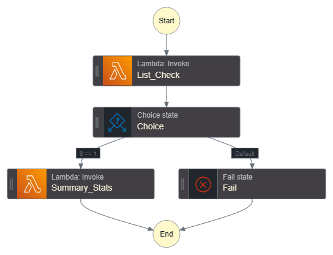
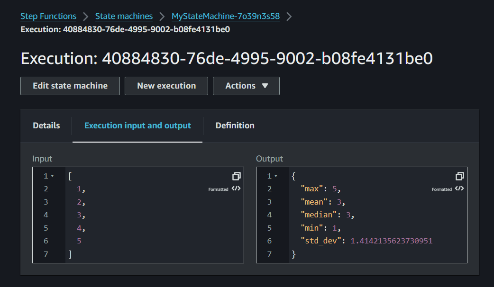

# AWS Step Functions State Machine with Lambda Functions

This project demonstrates the use of AWS Step Functions to orchestrate AWS Lambda functions. The state machine is designed to execute a Lambda function, make a decision based on the output, and then execute another Lambda function based on that decision.

## State Machine Diagram

Here is a diagram of the state machine:

## State Machine Execution

The state machine starts with the `List_Check` state, which executes a Python Lambda function that checks if the input is a numeric list. The output of this function is used in the `Choice` state to decide the next state. If the output is `1`, the state machine moves to the `Summary_Stats` state and executes a pre-defined Rust Lambda function that calculates summary statistics. If the output is not `1`, the state machine ends with a failure.

Here is a demonstration of a successful run of the state machine:

.png>)

And here is the final output of the state machine:

## Demo Video

For a more detailed walkthrough of the state machine and its execution, watch this demo video:

https://youtu.be/DfJelpsGil4

## Setup

To create the state machine:

1. Open the AWS Management Console and navigate to the Step Functions service.

2. Click on "Create a state machine" and choose "Design visually".

3. Add the states as described above, using the ARNs of the deployed Lambda functions.

4. Save and publish the state machine.

Now, you can start an execution of the state machine with an initial input.